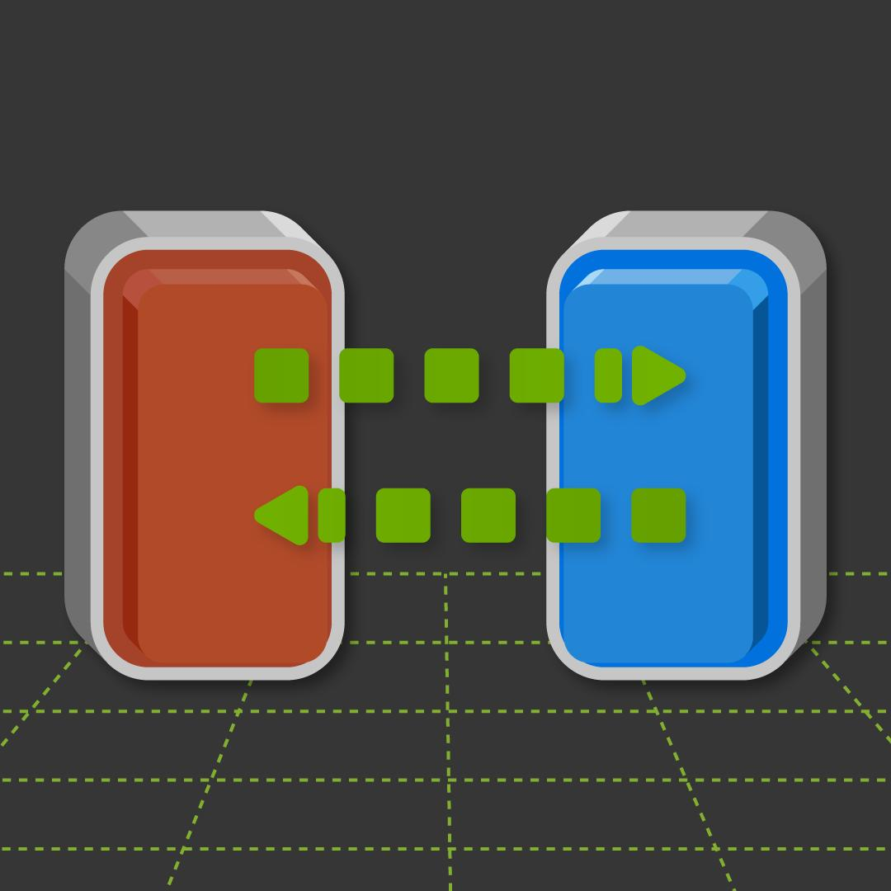

#  &nbsp; TSF-85 Tactile Sensor

## Table of Contents
- [Overview](#overview)
- [Isaac Sim Compatibility](#isaac-sim-compatibility)
- [Installation](#installation)
  - [Prerequisites](#prerequisites)
- [Usage](#usage)
- [Citation](#citation)
- [Contact](#contact)
- [More Information](#more-information)

## Overview

The TSF-85 Isaac Sim extension provides a custom user interface panel for generating
synthetic touch maps for the Robotiq tactile sensor **TSF-85**. It was developed in
collaboration with the Control and Robotics Laboratory (CoRo) at the École de
technologie supérieure (ÉTS) in Montréal. The extension acts as a simulation twin of
the sensor, enabling the generation of synthetic tactile data.

## Isaac Sim Compatibility

This extension is compatible with:

* NVIDIA Isaac Sim 5.0.0
* NVIDIA Isaac Sim 5.1.0 (developed and tested on this version)
* NVIDIA Isaac Sim 6.0.0 — support in progress
* Tested on Linux (Ubuntu 22.04)

## Installation

### Prerequisites

* Python 3.11.13 (the Python runtime bundled with Isaac Sim)
* [customtkinter](https://pypi.org/project/customtkinter/) for the GUI
* [Pandas](https://pypi.org/project/pandas/) for data handling
* [Matplotlib](https://pypi.org/project/matplotlib/) for visualization
* [h5py](https://pypi.org/project/h5py/) for HDF5 file interaction
* [pillow](https://pypi.org/project/pillow/) for image processing and manipulation
* [onnxruntime](https://pypi.org/project/onnxruntime/) for running the CNN model

### Steps

## Features

* User interface panel to interact with the sensor prim.
* Supports up to two sensors per environment.
* Data generation rate matches the simulation refresh rate.
* Automatic generation of CSV files containing essential information.
* User-defined output location for generated files.
* Real-time visualization of synthetic tactile maps.

## Usage

### Typical Workflow

1. Select a primitive in the scene that contains the sensor.
2. The extension identifies the soft object corresponding to the dielectric for file saving.
3. Change the output directory. Default location: `/home/User/Documents`.
4. Rename the generated files as needed. Default file name: `TactileData`.
5. In the "Tactile map visualization" section, select the checkbox to enable real-time
   viewing of the generated tactile maps.
6. Start the simulation.
7. Stop the simulation to end data saving.

### Notes

* Although only one base file name is required for file generation, two files are created.
  The first appends `_deformations` to the base name for the sensor-mesh deformation data.
  The second appends `_tactile_maps` for the file containing the generated tactile maps.

## Citation

## Contact

## More Information
