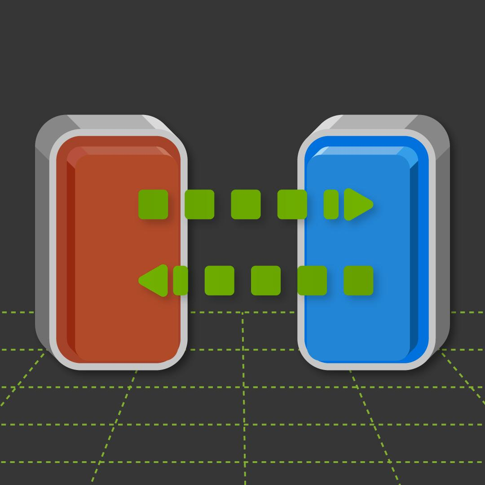
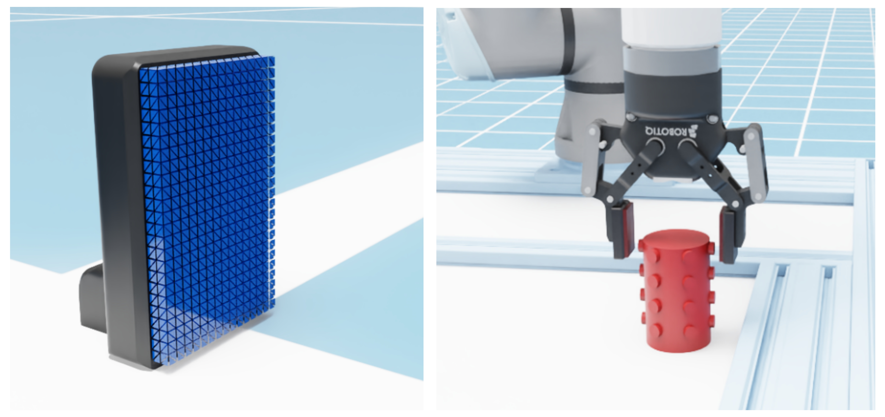

#  &nbsp; TSF-85 Tactile Sensor

## Table of Contents
- [Overview](#overview)
- [Isaac Sim Compatibility](#isaac-sim-compatibility)
- [Installation](#installation)
  - [Prerequisites](#prerequisites)
- [Features](#features)
- [Usage](#usage)
  - [Assets](#assets)
  - [Interactive — Isaac Sim GUI](#interactive--isaac-sim-gui)
  - [Headless — standalone Python script](#headless--standalone-python-script)
    - [Example 1 — Touch objects](#example-1--touch-objects)
    - [Example 2 — Grasp and lift objects](#example-2--grasp-and-lift-objects)
  - [Notes](#notes)
- [Citation](#citation)
- [Contact](#contact)
- [More Information](#more-information)

## Overview
The TSF-85 Isaac Sim extension provides a custom user interface panel for generating
synthetic tactile maps for the Robotiq tactile sensor **TSF-85**. It was developed in
collaboration with the Control and Robotics Laboratory (CoRo) at the École de
technologie supérieure (ÉTS) in Montréal.

<p align="center">
  
</p>

## Isaac Sim Compatibility
This extension is compatible with:
* NVIDIA Isaac Sim 5.1.0 (developed and tested on this version)
* NVIDIA Isaac Sim 6.0.0 — support in progress
* Tested on Linux (Ubuntu 22.04)

### Development environment
The extension was developed and validated on the following machine. Deformable-body
simulation and ONNX/cuDNN inference are both GPU-bound, so the GPU and driver/CUDA
versions are the most relevant figures to match.

| Component | Specification |
| --- | --- |
| OS | Ubuntu 22.04.5 LTS |
| CPU | 12th Gen Intel Core i9-12900H |
| GPU | NVIDIA RTX A2000 8GB Laptop GPU (8 GB VRAM) |
| RAM | 32 GB |
| NVIDIA driver | 580.159.03 |
| CUDA (driver) | 13.0 |
| cuDNN | 9.7.1 (bundled with Isaac Sim) |
| Isaac Sim | 5.1.0 |
| Python | 3.11.13 (bundled with Isaac Sim) |

## Installation
### Prerequisites
* Python 3.11.13 (Python runtime bundled with Isaac Sim)
* [NumPy](https://pypi.org/project/numpy/) for array and math operations
* [onnxruntime](https://pypi.org/project/onnxruntime/) for running the CNN model
* [Pillow](https://pypi.org/project/pillow/) for rendering the tactile-map heatmap images

> NumPy and Pillow usually ship with the Python runtime bundled in Isaac Sim, so in a
> standard install you typically only need to add `onnxruntime`. Install into Isaac Sim's
> bundled Python (e.g. `./python.sh -m pip install onnxruntime`), not your system Python.

### Steps
A short summary of the install is below. For the full walkthrough, see
📖 [docs/installation.md](docs/installation.md).

1. Clone the repository.
2. Add the extension's search path in Isaac Sim (point it at the folder containing the
   extension) and enable **TSF_85_Ext** — either through the Extension Manager (GUI) or
   via carb settings in a Python launcher (see [Headless](#headless--standalone-python-script)).

## Features
* User interface panel to interact with the sensor prim.
* Supports up to two sensors per environment.
* Data generation rate matches the simulation refresh rate.
* Automatic generation of CSV files containing essential information.
* User-defined output location for generated files.
* Real-time visualization of synthetic tactile maps.

## Usage
The extension can be driven two ways: **interactively** through the Isaac Sim GUI, or
**headless** from a standalone Python script that wires the tactile-data pipeline
directly into your own simulation.

### Assets
The `assets/` folder contains the USD files used by the example scenes:

* **Robotiq 2F-85 gripper (modified)** — a 2F-85 adaptive gripper modified to mount the
  TSF-85 tactile sensors in place of the standard fingertips.
* **TSF-85 sensor** — the tactile sensor USD, including the deformable sensing mesh that
  the extension reads to compute deformation and predict the tactile map.

These are referenced by the example scenes in `examples/scenes/`. For step-by-step
instructions on mounting the TSF-85 sensors onto the gripper, see
📖 [docs/attaching_sensors.md](docs/attaching_sensors.md).

### Interactive — Isaac Sim GUI

📖 For the full step-by-step workflow and a walkthrough of every panel control, see
[docs/gui_guide.md](docs/gui_guide.md).

### Headless — standalone Python script
The extension can run entirely from Python, with no GUI. This lets you implement the
tactile-data generation pipeline directly inside your own standalone script: you
configure the sensor, register the extension, and step physics yourself, and the
extension records the same CSV files it would produce in the GUI.

To wire the pipeline into a script, set the extension's carb settings **before**
enabling it, then register the extension path and enable it:

```python
import carb.settings

settings = carb.settings.get_settings()
settings.set("/exts/TSF_85_Ext/headless",    True)          # drop the GUI/panel gate
settings.set("/exts/TSF_85_Ext/sensor_root", SENSOR_ROOT)   # sensor 1 case prim path
# settings.set("/exts/TSF_85_Ext/sensor_root_2", SENSOR_ROOT_2)  # optional: enables 2-sensor mode
settings.set("/exts/TSF_85_Ext/output_dir",  OUTPUT_DIR)    # where the CSVs go
settings.set("/exts/TSF_85_Ext/base_name",   BASE_NAME)     # output filename prefix

from omni.kit.app import get_app
ext_mgr = get_app().get_extension_manager()
ext_mgr.add_path(EXT_SEARCH_PATH)   # folder containing the extension, so Kit can discover it
ext_mgr.set_extension_enabled_immediate("TSF_85_Ext", True)
```

### Notes
* This extension is best suited for scenes or tasks where **static friction at the soft
  contact is not involved, or does not play a critical role** (for example, squeeze /
  normal-force experiments). The simulator's deformable-body solver models only kinetic
  friction at the soft-body ↔ rigid-body contact, so tasks that depend on a static-
  friction "stick" phase (such as lifting an object by friction alone) cannot be
  reproduced faithfully without a workaround like the grasp aid in Example 2.
* Although only one base file name is required for file generation, two files are created.
  The first appends `_deformations` to the base name for the sensor-mesh deformation data.
  The second appends `_tactile_maps` for the file containing the generated tactile maps.
* The extension can also run in headless mode, driven entirely by a standalone
  Python script without launching the Isaac Sim GUI.

## Citation
If you use this extension in your research, please cite the following paper:
```bibtex
@article{delacruz2025hybrid,
  title   = {A hybrid elastic-hyperelastic approach for simulating soft tactile sensors},
  author  = {De la Cruz S{\'a}nchez, Berith Atemoztli and Roberge, Jean-Philippe},
  journal = {Frontiers in Robotics and AI},
  volume  = {12},
  pages   = {1639524},
  year    = {2025},
  publisher = {Frontiers Media SA}
}
```

## Contact
For any questions, suggestions, or feedback, please feel free to reach out:

**Lead Maintainer**
**Berith De la Cruz Sánchez**
Email: [berithcruzs@gmail.com](mailto:berithcruzs@gmail.com)
GitHub: [BerithCS](https://github.com/BerithCS)

**Project Supervisor**
**Prof. Jean-Philippe Roberge**
Control and Robotics Laboratory (CoRo), École de technologie supérieure (ÉTS)
Email: [jean-philippe.roberge@etsmtl.ca](mailto:jean-philippe.roberge@etsmtl.ca)

## More Information
We are currently developing a **hybrid co-simulation** approach to compensate for the
limitations of deformable bodies in the simulator, with the goal of recovering the
physical behavior (including static friction at the soft contact) that the current
deformable-body solver cannot reproduce. This section will be updated as that work
matures.

