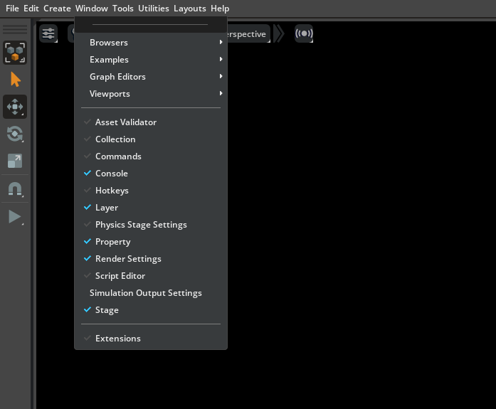
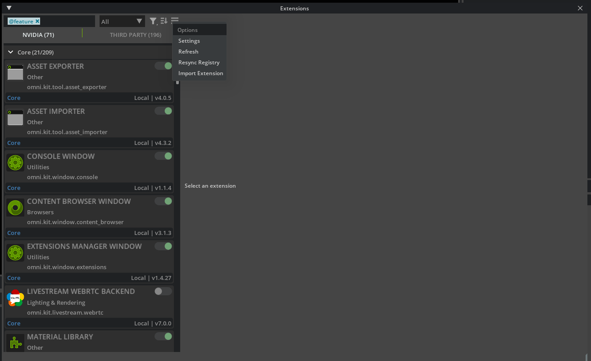
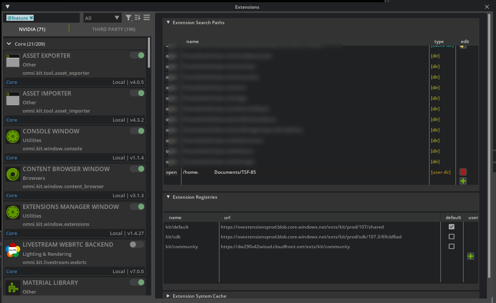
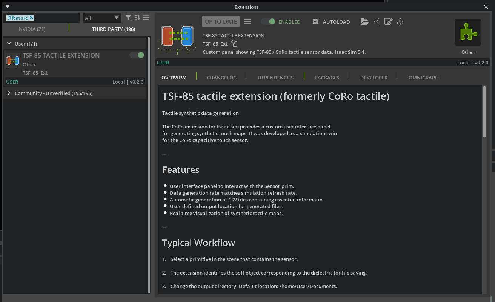
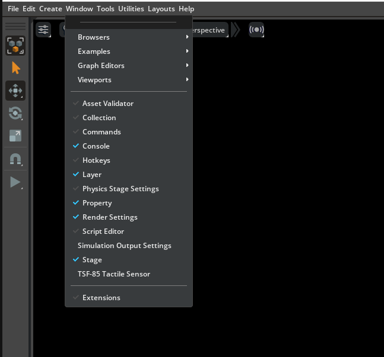
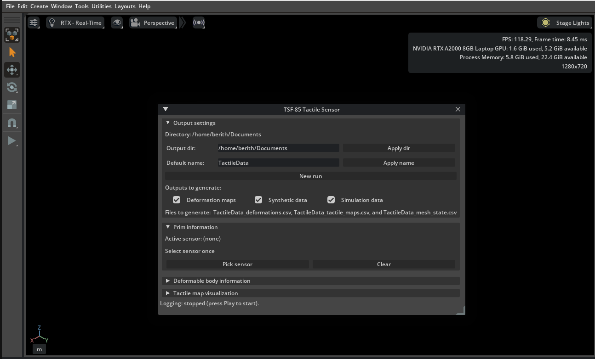

# Installation Guide — TSF-85 Tactile Sensor Extension

This guide walks through installing and enabling the TSF-85 extension in NVIDIA Isaac Sim.

## Steps

### 1. Clone the repository
```bash
git clone https://github.com/Lab-CORO/TSF-85.git
```

### 2. Open Isaac Sim
Launch Isaac Sim, then open the extensions window from the top menu:
**Window → Extensions**.

<p align="center">
  
</p>

### 3. Open the extension settings
In the **Extensions** window, open the options menu (top-right) and select
**Settings**.

<p align="center">
  
</p>

### 4. Add the extension search path
Under **Extension Search Paths**, add the path to the main folder you cloned from the
repository (point it at the top-level folder, e.g. `/path/.../TSF-85`).

<p align="center">
  
</p>

### 5. Enable the extension
Once the path is added, the extension is detected and appears in the **Third Party**
panel as **TSF-85 Tactile Extension**. Turn on **Enabled** to activate it, and check
**Autoload** so it loads automatically with Isaac Sim.

<p align="center">
  
</p>

### 6. Open the panel from the Window menu
The extension now appears in the **Window** menu as **TSF-85 Tactile Sensor**.

<p align="center">
  
</p>

### 7. Open the extension
Click the menu entry to open the extension. Its panel appears in the middle of the
main window.

<p align="center">
  
</p>

---

Once the panel is open, see the [GUI Guide](gui_guide.md) for how to use it, or the
[main README](../README.md) for headless (script-based) usage.
